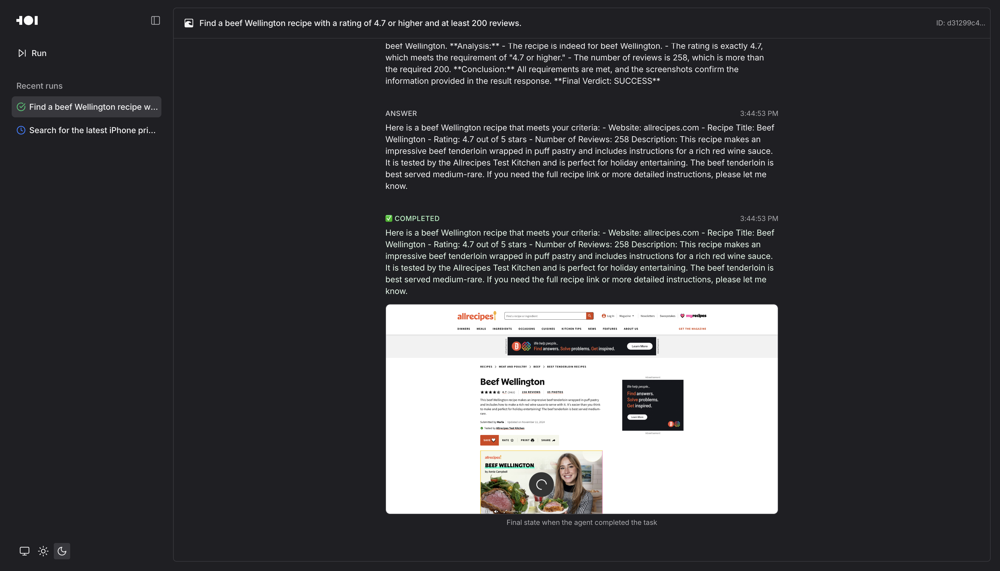

# Surfer-H Frontend

A Next.js web interface for the open SurferH web agent, an autonomous web agent powered by Holo-1 that can navigate and interact with websites to accomplish real-world tasks.

## Features

- **Task Creation**: Simply describe what you want to accomplish in natural language
- **Real-time Monitoring**: Watch your agent complete tasks through the Surfer View
- **Trajectory Management**: View, replay, and manage automated browsing sequences
- **Settings Configuration**: Customize agent behavior, target URLs, and execution parameters
- **Example Tasks**: Get started quickly with pre-configured example prompts



*The Surfer-H web interface in action, showing real-time monitoring as the agent searches for a beef Wellington recipe*

## Getting Started

### Prerequisites

- **Node.js 18+** - [Download from nodejs.org](https://nodejs.org/) 
- **npm** (comes with Node.js) or **yarn** or **pnpm**
- **Python 3.11+** - Required for the backend
- **uv** - Python package manager ([Install instructions](https://docs.astral.sh/uv/getting-started/installation/))


### Quick Start

The easiest way to start both the backend and frontend is to run from the root directory:

```bash
./launch.sh
```

This will automatically start both the Surfer-H backend and the Next.js frontend.

### Manual Installation

1. Install dependencies:
```bash
npm install
# or
yarn install
# or
pnpm install
```

2. Run the development server:
```bash
npm run dev
# or
yarn dev
# or
pnpm dev
```

3. Open [http://localhost:3000](http://localhost:3000) in your browser

### Usage

1. **Create a Task**: Enter a natural language description of what you want to accomplish
   - Example: "Find a beef Wellington recipe with a rating of 4.7 or higher and at least 200 reviews"
   - Example: "Search for the latest iPhone price on Amazon"

2. **Configure Settings**: Set your target URL and adjust agent parameters

3. **Start Browsing**: Launch the agent and watch it work in real-time

4. **Monitor Progress**: Use the Surfer View to see exactly what the agent is doing

## Example Tasks

The interface includes several example tasks to get you started:

- Finding recipes with specific criteria
- Searching for products on e-commerce sites
- Booking travel arrangements
- Checking weather forecasts

## Architecture

This frontend is built with:
- **Next.js 15** - React framework with App Router
- **React 19** - Latest React with concurrent features
- **TypeScript** - Type-safe development
- **Tailwind CSS v4** - Latest utility-first CSS framework
- **shadcn/ui** - Modern component library built on Radix UI
- **TanStack React Query v5** - Server state management

## API Integration

The frontend communicates with the Surfer-H backend through REST endpoints:
- `/api/trajectories` - Manage task execution
- `/api/trajectory-events` - Real-time task monitoring

## Development

### Project Structure

```
src/
├── app/                    # Next.js app router pages
├── components/            # React components
│   ├── Home/             # Homepage components
│   ├── SurferH/          # Agent monitoring components
│   └── common/           # Shared UI components
├── hooks/                # Custom React hooks
├── providers/            # Context providers
└── utils.ts             # Utility functions
```

### Key Components

- **Homepage**: Task creation and example prompts
- **SurferView**: Real-time agent monitoring
- **CreateTrajectoryInputArea**: Task input and settings
- **EventStream**: Live task progress updates


## License

See the main project [LICENSE](../LICENSE) file for details.
